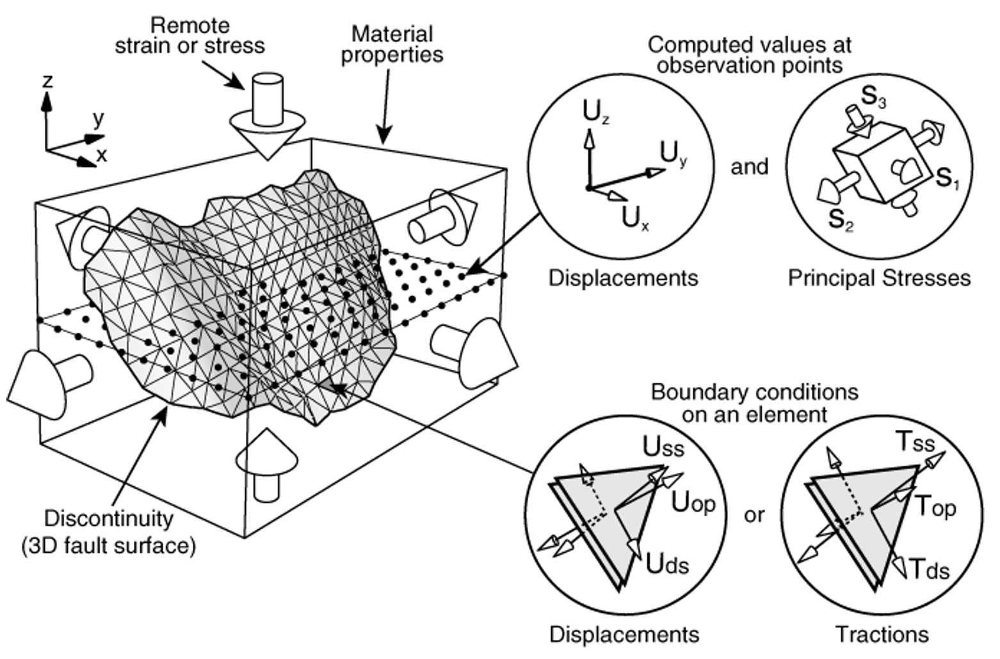

# Arch python documentation

This is the official documentation of **Arch** for Python.

**Arch** is a displacement discontinuity method (a boundary element method) developped by [YouWol](https://youwol.com). It is the successor of [**Poly3D**](https://en.wikipedia.org/wiki/David_D._Pollard) (Stanford) and [**iBem3D**](https://www.sciencedirect.com/science/article/pii/S0098300414001496) (Igeoss, Schumberger).

This [boundary element](https://en.wikipedia.org/wiki/Boundary_element_method) code is based on [A. L. Thomas Stanford master's thesis](https://searchworks.stanford.edu/view/2830996), with extensions from [F. Maerten Stanford and Montpellier PhD's thesis](https://www.researchgate.net/publication/257925612_Geomechanics_to_solve_geological_structure_issues_forward_inverse_and_restoration_modeling), a main publication from [F. Maerten, L. Maerten and D. D. Pollard](https://www.sciencedirect.com/science/article/pii/S0098300414001496) and with corrections for singular points from [Nikkhoo et al.](https://academic.oup.com/gji/article/201/2/1119/572006)

## 👉 [Python documentation](https://doc.youwol.com/arch-doc-python/)

## 👉 [Main references using Arch](https://doc.youwol.com/arch-doc-python/references.html#)

## Please cite:

Maerten, F., Maerten, L., & Pollard, D. D. (2014). [iBem3D, a three-dimensional iterative boundary element method using angular dislocations for modeling geologic structures. ](https://www.sciencedirect.com/science/article/abs/pii/S0098300414001496) Computers & Geosciences, 72, 1-17.
